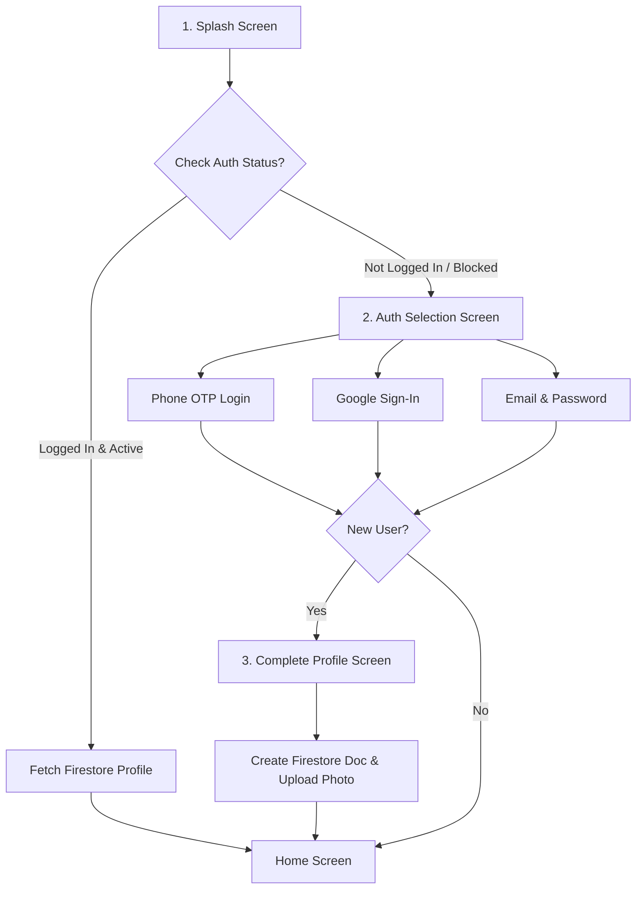

# Production Firebase Authentication & Firestore User System Guide

This document provides a step-by-step integration guide for the **Firebase Authentication and Cloud Firestore User Management System** in your Android application.

---

## 🏗️ Architecture & User Flow



---

## 📊 Firestore Database Schema (`Users` Collection)

| Field Name | Type | Description |
| :--- | :--- | :--- |
| `uid` | String | Unique Firebase Auth ID |
| `fullName` | String | User's Full Name |
| `email` | String | Primary Email Address |
| `phoneNumber` | String | Verified Phone Number (+91...) |
| `profilePhoto` | String | Cloud Storage Image URL |
| `userType` | String | `Customer` \| `Owner` \| `Admin` |
| `isVerified` | Boolean | True if Email or Phone OTP verified |
| `accountStatus` | String | `active` \| `blocked` \| `suspended` |
| `createdAt` | Long | Account Creation Timestamp |
| `lastLogin` | Long | Last Active Timestamp |
| `deviceId` | String | Unique Hardware Identifier |
| `notificationToken` | String | Firebase Cloud Messaging (FCM) Token |
| `language` | String | Preferred ISO Language Code (`en`, `hi`) |
| `address` | String | Street Address |
| `state` | String | State / Province |
| `city` | String | City Name |

---

## 🛠️ Step-by-Step Firebase Integration Instructions

### Step 1: Add `google-services.json`
1. Go to **[Firebase Console](https://console.firebase.google.com/)**.
2. Add an Android App with package name: `com.zenithlife.app`.
3. Download **`google-services.json`** and place it inside your project at:
   ```text
   android/app/google-services.json
   ```

### Step 2: Enable Authentication Methods in Firebase Console
In your Firebase Console ➔ **Authentication** ➔ **Sign-in method**:
- ✅ **Phone:** Enable Phone Authentication.
- ✅ **Google:** Enable Google Sign-In and add SHA-1 fingerprint (`keytool -list -v -keystore ~/.android/debug.keystore`).
- ✅ **Email/Password:** Enable Email/Password with Email Link Verification.

### Step 3: Deploy Security Rules
1. Copy contents of **`android/app/firestore.rules`** into Firebase Console ➔ **Firestore Database** ➔ **Rules**.
2. Copy contents of **`android/app/storage.rules`** into Firebase Console ➔ **Storage** ➔ **Rules**.

---

## 💻 Kotlin Native Code Files Location

- Data Schema: `android/app/src/main/java/com/zenithlife/app/auth/UserModel.kt`
- Auth Manager: `android/app/src/main/java/com/zenithlife/app/auth/FirebaseAuthManager.kt`
- Firestore Rules: `android/app/firestore.rules`
- Storage Rules: `android/app/storage.rules`
